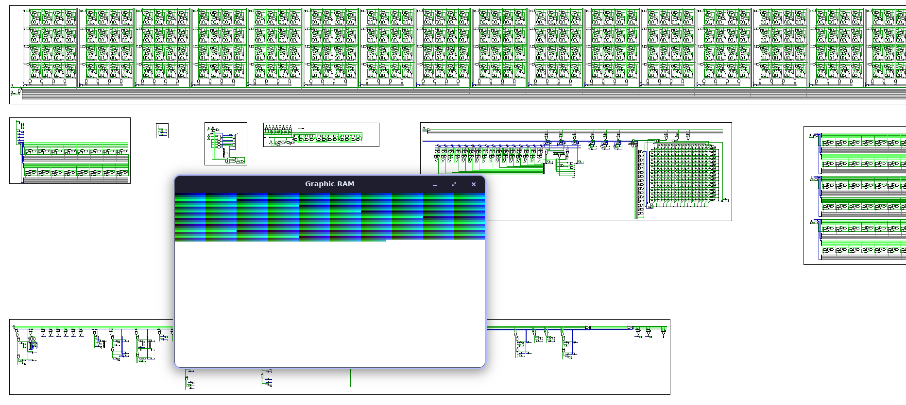
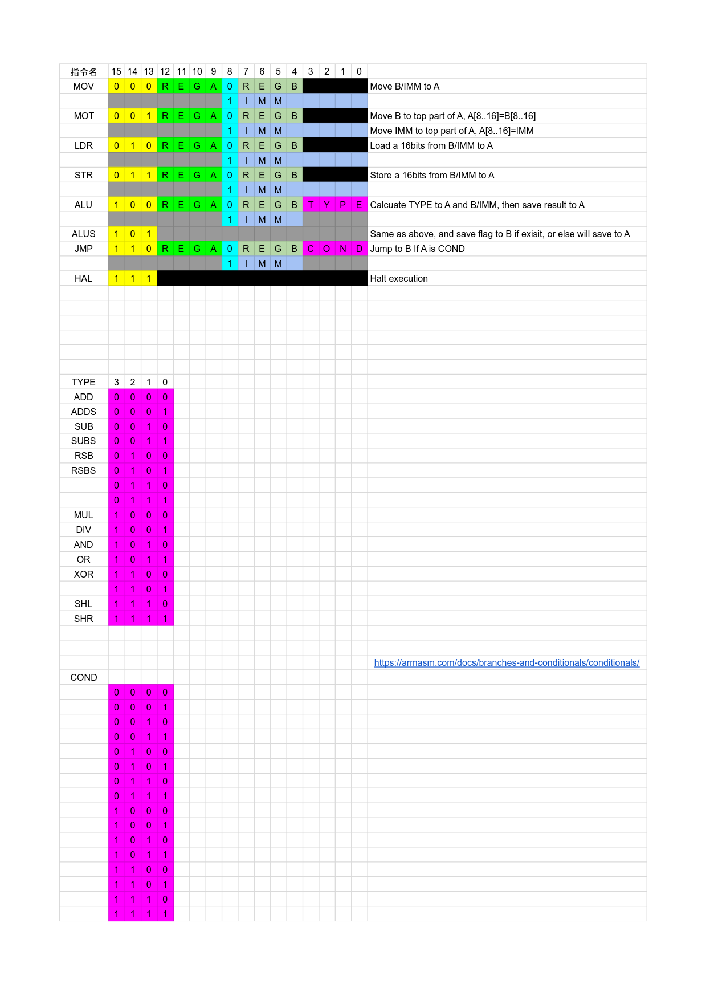
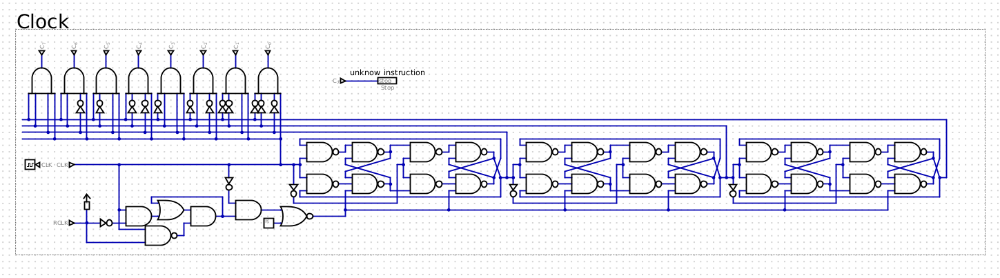
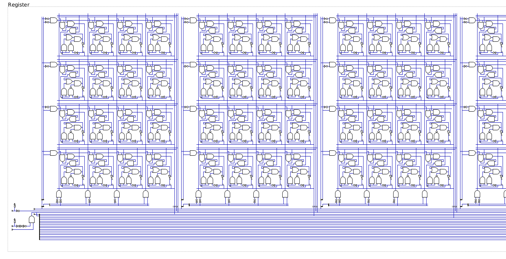
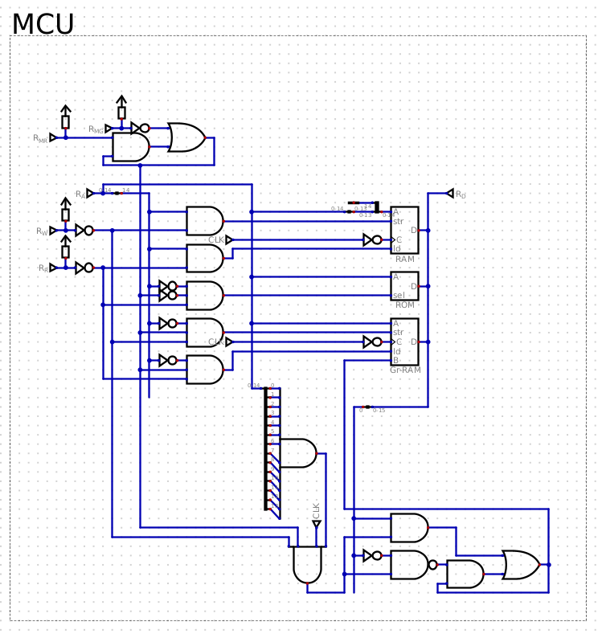
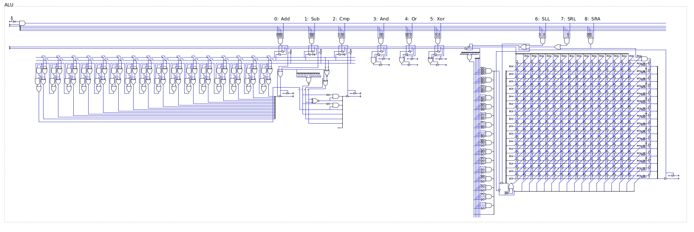
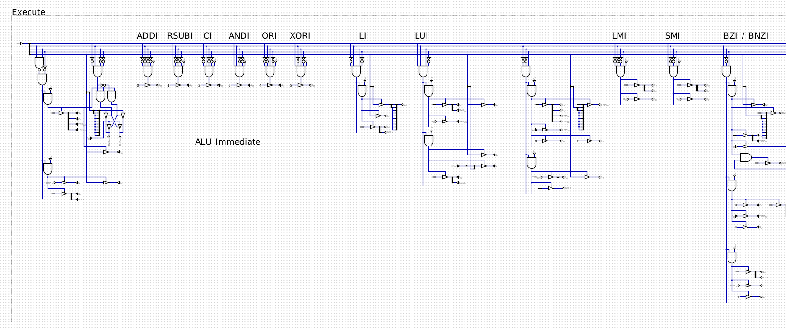

# 16I

A hand-drawn 16-bit multicycle CPU with a custom instruction set.




## Highlights

- 16-bit data path with a **multicycle** control approach
- A compact custom ISA with **I / R / B / Z** instruction formats
- 16-register bank using shared **data bus** and **address bus**
- Memory mapping that can switch the lower region between **ROM** and **Graphic RAM**
- ALU supports arithmetic, logic, compare, and single-cycle shifting (barrel shifter)


## Getting Started

Builds are driven by [`just`](https://just.systems/).

### Prerequisites

- Install `just`

### Build

The build compiles `assembly/main.asm` and produces a binary output:

```bash
just build
```

Output:

- `bin/main.bin`

### Debug Build (Human-Readable Output)

The debug build compiles the same entry (`assembly/main.asm`) and emits a human-readable, annotated form:

```bash
just debug
```

Output:

- `bin/main.txt`


## Assembly Layout

There are three key assembly files (typically used via includes from `assembly/main.asm`):

- `16i_v4.asm`
  - Defines the full instruction set and core assembly rules/macros.
- `pesudo.asm`
  - Pseudo-instructions (syntactic sugar) such as long jumps and compare-and-branch patterns that expand into multiple real instructions.
- `graphic.asm`
  - Sample color / graphics-related code or data intended for the Graphic RAM mode.


## Instruction Set (16ISA)

A simple 16-bit instruction set with three formats:

- **I-format** (immediate)
- **R-format** (register)
- **B-format** (branch)
- **Z-format** (halt, switch memory space)

All immediate fields are **8-bit wide**.

The full encoding and field layout are documented here:

[](./imgs/16ISA.pdf)


## Architecture

This section gives a high-level view of the CPU blocks and the reasoning behind a few design choices.

### Clock

The design uses **three master-slave flip-flops** as a counter to drive multicycle sequencing.



### Registers

A bank of **16 level-triggered registers** connected via a shared data bus and address bus.

This helps keep wiring and control logic manageable while still supporting a useful number of registers.



### Memory Control Unit (MCU)

The memory space is split into two halves:

- `0x0000 ~ 0x7FFF`: ROM / Graphic RAM (switchable)
- `0x8000 ~ 0xFFFF`: RAM

When the `mg` instruction executes, the lower half is replaced by **Graphic RAM**.
The `mr` instruction switches the lower half back to **ROM**.

This makes it possible to reuse the same address range for either instruction/data stored in ROM or graphics-oriented data in Graphic RAM, depending on the current mode.



### Arithmetic Logic Unit (ALU)

Supported operations:

- `Add`, `Sub`, `Cmp`
- `And`, `Or`, `XOr`
- Bit shifts

Implementation notes:

- The first three operations are implemented with a **ripple adder**.
- Shifts use a **barrel shifter**, completing in one cycle.



### Decode and Execute

Instruction decode and execute logic generates control signals for:

- Register read/write
- ALU operation selection
- Memory access
- Branch / PC update
- Multicycle sequencing



## Outputs

After building, you will typically look at one of these artifacts:

- `bin/main.bin`: machine-oriented binary output (for loading/running)
- `bin/main.txt`: debug output (annotated, human-readable)

## License

MIT
